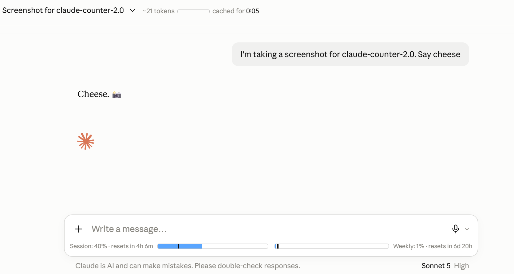

# Claude Counter

A minimal browser extension that shows token count, cache timer, and usage bars on claude.ai.

> Fork of [she-llac/claude-counter](https://github.com/she-llac/claude-counter) v0.4.2, updated for the claude.ai UI redesign (August 2026).

## Features

- **Token count** — Approximate token count for the current conversation, with a mini progress bar against the 200k context limit
- **Cache timer** — Countdown showing how long the conversation remains cached (cheaper to continue)
- **Usage bars** — Session (5-hour) and weekly (7-day) usage from Claude's native API, with progress bars and reset countdowns

## What's changed from upstream v0.4.2

- Fixed broken selectors after claude.ai's UI redesign (`chat-title-split`, `bg-surface-3`)
- Usage bars now render inside the rounded composer box
- Bars persist across page refreshes via `chrome.storage.local`
- Bars always visible with 0% fallback (free plan returns nulls until first message)
- Org-scoped usage snapshot with expired-window cleanup
- Version bumped to 2.0.0 (major jump to distinguish from upstream)

## Fixes in this fork (v2.0.1)

The v2.0.0 redesign work loaded but the usage/token data never appeared. Three bugs fixed:

- **Added the `storage` permission** to `manifest.json` — without it `chrome.storage` was `undefined`, throwing `Cannot read properties of undefined (reading 'sync')` on load
- **Guarded the `chrome.storage.sync` call** in `main.js` so a missing permission degrades gracefully instead of crashing `handleUrlChange()`
- **Corrected the injected bridge path** in `bridge-client.js` (`claude-counter/bridge.js` → `src/injected/bridge.js`) — the mismatch 404'd the bridge, so every usage/conversation fetch silently timed out and the bars stuck at 0%

## v2.0.2

- Reset countdown now shows a live seconds tick in the final minute (`57s` → `0s`) instead of jumping to `0m`
- Restored the original she-llac icon set
- Fixed release packaging so `manifest.json` sits at the archive root (the earlier `.zip`/`.xpi` nested it in a subfolder, which broke the Firefox install)

## Installation

**Chrome / Edge / Chromium**

1. Download `claude-counter-2.0.2.zip` from [Releases](../../releases/tag/v2.0.2)
2. Go to `chrome://extensions` and enable **Developer mode**
3. Unzip the folder, then drag the unzipped folder onto the page (or click **Load unpacked** and select it)

**Firefox**

1. Download `claude-counter-2.0.2.xpi` (Mozilla-signed) from [Releases](../../releases/tag/v2.0.2)
2. Drag it into any Firefox window and click **Add**

## How it works

- Intercepts Claude's API responses to read conversation data and usage info
- Uses a vendored tokenizer (`o200k_base`) for approximate token counting
- Uses Claude's `/usage` plus live SSE `message_limit` data for accurate progress bars
- Watches for DOM changes to inject UI elements as you navigate

## Privacy

- All data stays local — no external servers, no tracking
- Reads your `lastActiveOrg` cookie to query Claude's `/usage` endpoint
- Makes requests only to `claude.ai`

## Credits

- Original project by [she-llac](https://github.com/she-llac/claude-counter) (MIT)
- Token counting via [gpt-tokenizer](https://github.com/niieani/gpt-tokenizer) (MIT)
- Inspired by [Claude Usage Tracker](https://github.com/lugia19/Claude-Usage-Extension) by lugia19

## License

MIT — see [LICENSE](LICENSE)
